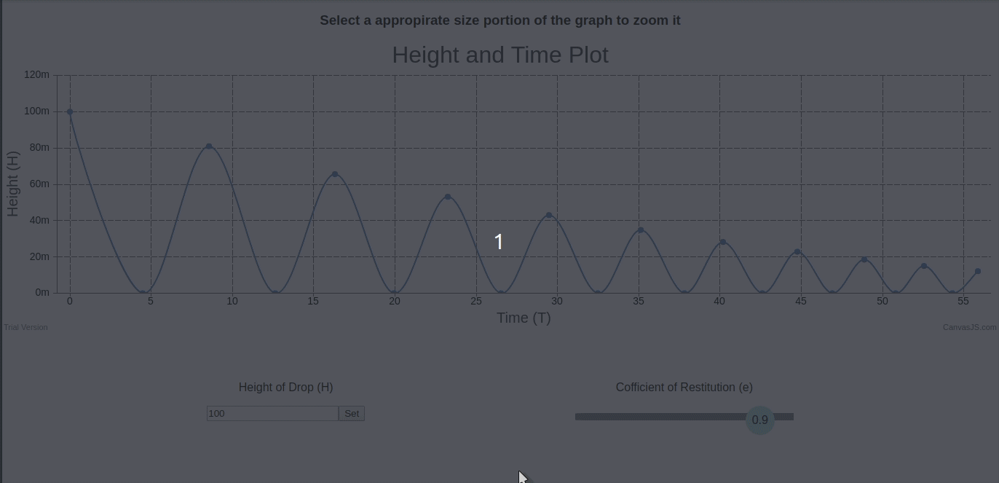
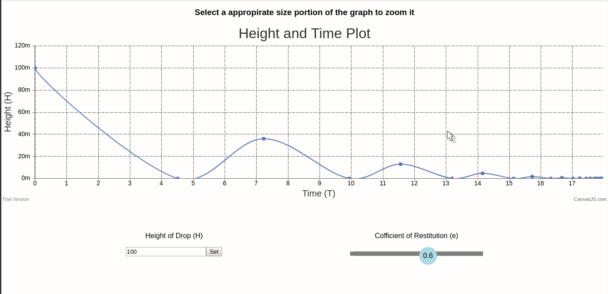

# Newton Physics Plotter

- Author: Kumar Saurabh Raj

- Technologies used: React, NodeJs, Express

## About

- Aims to help pre-university students get a better grasp on classical physics by helping them visualise different graphs dependent upon qunatities which could changed dynamically.

## Features

- Collision Plotter
  - A body is dropped from from a certain height(**H**) on a surface with cofficient of restitution(**e**)
  - Displacement time graph for the body can be plotted for initial and subsequent collisions with the surface
  - **H** and **e** can be adjusted using sliders, the graph plotted with automatically update when values are adjusted
  - The graph can be zoomed to enlarge a selected section and moved to view other sections, please go through the demos.

## Demo

Here is a working demo of the application.

A area of the curve and be selected to zoom into it.

## Setup - Development mode

First intall all the dependencies for server by running `npm install` in the root directory then run `npm install` in the client directory.

Go to the root directory and execute `npm run server`
open a new ternimal in the root directory and execute `npm run client`

## Setup - Production

First intall all the dependencies for server by running `npm install` in the root directory then run `npm install` in the client directory.

Go to client directory and execute `npm run build`
Then come back to the root directory and execute `npm start`

The client should be accessible on `localhost:8000` or some other port if that is changed in `server.js` file
